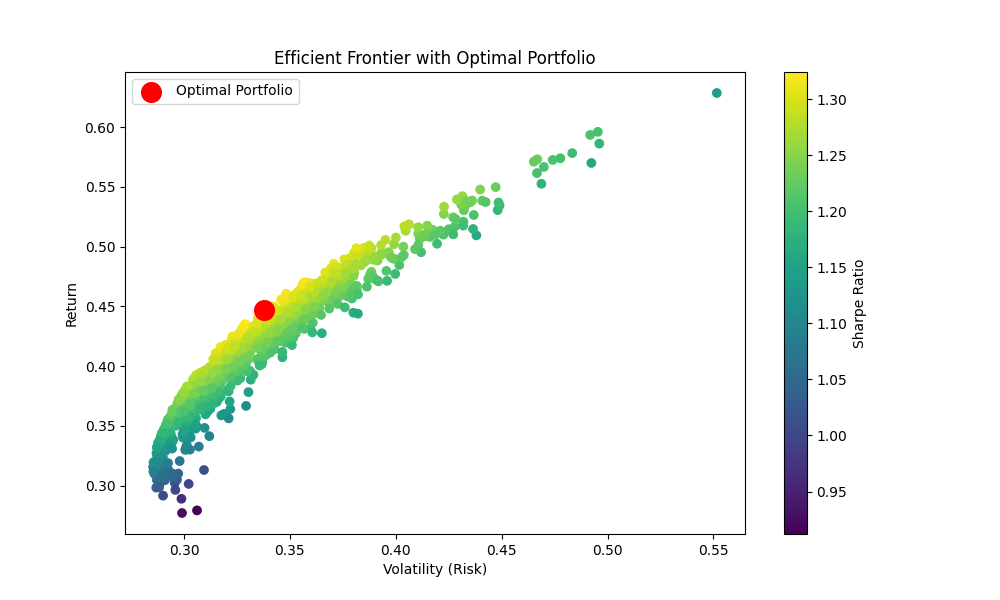

# Stock Portfolio Analysis

This project analyzes stock market data and builds optimal portfolios using Modern Portfolio Theory.

## Features

- Download stock data using yfinance
- Calculate daily returns
- Plot stock price trends
- Compute correlation matrix
- Simulate random portfolios
- Find optimal portfolio using Sharpe Ratio
- Visualize Efficient Frontier

## Technologies Used

- Python
- Pandas
- NumPy
- Matplotlib
- Seaborn
- yfinance

## Concepts Used

- Portfolio Return
- Portfolio Volatility (Risk)
- Sharpe Ratio (Risk-adjusted return)
- Efficient Frontier
- Correlation Analysis

## Mathematical Background

Portfolio Return:

Rp = wᵀ r

where  
w = vector of portfolio weights  
r = vector of asset returns  

Portfolio Variance:

σ² = wᵀ Σ w

where  
Σ = covariance matrix of asset returns  

Sharpe Ratio:

Sharpe = (Rp - Rf) / σp

where  
Rf = risk-free rate

## Efficient Frontier Visualization

## How to Run

Clone the repository:

git clone https://github.com/Rohan08125/stock-portfolio-analysis.git

Navigate to the folder:

cd stock-portfolio-analysis

Install dependencies:

pip install -r requirements.txt

Run the notebook:

jupyter notebook
